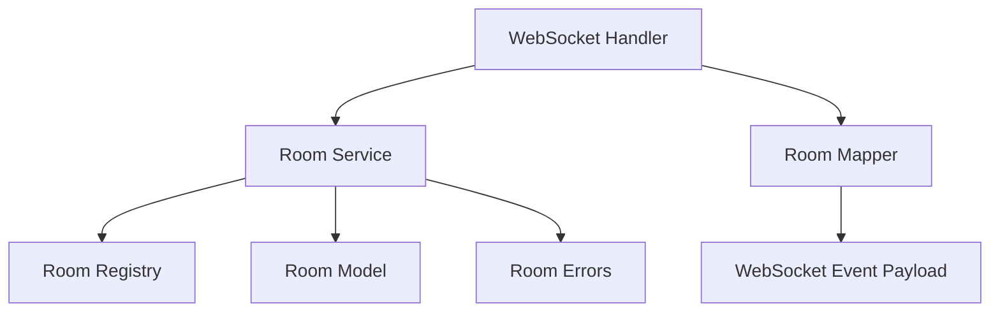

## Goal
Create the in-memory room model and registry used by the multiplayer flow.

## Scope
- Define room state structure
- Add room registry storage
- Support room lookup by id/code
- Track room status and player membership

## Done when
- Room state can be created and queried in memory
- Room lifecycle fields required by the docs are present
- The registry is ready for room service logic

## Source docs
- `plan/implementation-plan.md`
- `plan/functional-spec.md`
- `plan/technical-design.md`

## Module design
Plain-text flow:

```text
websocket handler
    -> room service
        -> room registry
        -> room model
    -> room mapper
    -> websocket emit
```

Mermaid:



- `backend/app/modules/room/models.py`
  - Domain model for room state.
  - Contains `RoomPlayerState`, `RoomState`, and room-local business rules.
  - Does not depend on websocket transport or response/event schemas.

- `backend/app/modules/room/service.py`
  - Application service for room use cases.
  - Coordinates room flows such as create, join, leave, ready, and start checks.
  - Uses `registry.py`, `models.py`, and `errors.py`.

- `backend/app/modules/room/registry.py`
  - In-memory room storage for lookup and lifecycle management.
  - Responsible for add/get/remove operations only.
  - Does not contain room business rules.

- `backend/app/modules/room/mappers.py`
  - Maps domain state to outbound websocket event or response schema.
  - Converts `RoomState` to `RoomUpdatedEvent` payloads.
  - Keeps output formatting outside the domain model.

- `backend/app/modules/room/errors.py`
  - Module-specific errors for room rules and use cases.
  - Example: room not found, duplicate nickname, room not joinable, not host.

- Expected flow
  - websocket handler validates payload and calls room service
  - room service loads/saves room state through registry
  - room service applies business rules through room model methods
  - mapper converts room state to outbound event payload

## Implementation checklist

### 1. Backend model
- backend/app/modules/room/models.py
- RoomPlayerState: player_id, nickname, is_ready, status
- RoomState: room_id, room_code, status, host_player_id, players, created_at

### 2. Domain methods
- get_player(player_id)
- has_nickname(nickname)
- is_joinable()
- is_host_player(player_id)

### 3. Backend service
- backend/app/modules/room/service.py
- Use cases
    - create_room(...)
    - join_room(...)
    - set_ready(...)
- Depends on `models.py`, `registry.py`, and `errors.py`

### 4. Backend registry
- backend/app/modules/room/registry.py
- rooms_by_id: dict[str, RoomState]
- room_id_by_code: dict[str, str]
- API
    - add(room)
    - get_by_id(room_id)
    - get_by_code(room_code)
    - remove(room_id)

### 5. Backend mapper
- backend/app/modules/room/mappers.py
- API
    - to_room_updated_event(room)

### 6. Backend errors
- backend/app/modules/room/errors.py
- RoomNotFoundError
- DuplicateRoomCodeError
- DuplicateNicknameError
- RoomNotJoinableError
- NotHostError

### 7. Room rule
- room_code is unique
- 1 host for each room
- nickname is room unique
- only joinable while status == waiting
- max 5 players

### 8. Unit test
- create room and store in registry
- lookup room by room_id
- lookup room by room_code
- reject duplicate room_code
- reject duplicate nickname in room
- reject join when room status is not waiting
- map RoomState to room:updated payload correctly
