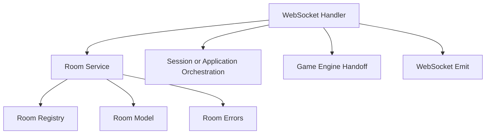

## Goal
Define the additional lobby validation and start-game preconditions needed before realtime handlers and frontend wiring.

## Scope
- Refine validation for existing `join_room(...)` and `set_ready(...)` room methods
- Validate start-game preconditions
- Transition room from `waiting` to `starting`

## Done when
- `join`, `ready`, and start-related room service flows have explicit validation rules and room-domain errors
- Room lifecycle service supports `validate_start_preconditions(...)` and `waiting -> starting`
- Invalid transitions return defined room-domain errors
- Validation rules are explicit per method and covered by unit tests
- The service is ready to be called by socket handlers

## Source docs
- `plan/implementation-plan.md`
- `plan/functional-spec.md`
- `plan/technical-design.md`

## Module design
Plain-text flow:

```text
websocket handler
    -> room service
        -> room registry
        -> room model
        -> room errors
    -> session/application orchestration
    -> game engine handoff
    -> websocket emit
```

Mermaid:



## Room boundary
- `room` module owns lobby-phase room lifecycle and validation rules.
- Room state answers:
  - which room exists for a `roomId` or `roomCode`
  - which players belong to the room
  - who is the host
  - whether each player is ready
  - whether the room can accept join or start requests
- Room service owns room-domain validation only.
- Room service does not create `playerSessionId` or manage socket binding state.
- Room service does not query session state directly for connectivity checks.
- Connectivity used by start validation is read from `RoomPlayerState.status`.
- Room service does not emit websocket events directly.
- Room service does not build deck or create authoritative game state in this issue.
- This issue stops at `waiting -> starting`.
- `starting -> in_game` and `in_game -> finished` are out of scope for this issue.

## Key decisions
- `game:start` is manual and host-triggered in this issue.
- `join_room(...)` applies validations in this order:
  - room exists
  - room status is `waiting`
  - room has available capacity
  - nickname is unique within the room
- `validate_start_preconditions(...)` reads connectivity from `RoomPlayerState.status`.
- Start requests on rooms outside `waiting` return `RoomNotWaitingError`.
- This issue only covers lobby validation and the `waiting -> starting` transition.

## Implementation checklist
### 1. Service changes
- `backend/app/modules/room/service.py`
- Use cases
  - refine `join_room(room_code, nickname)` validation and error handling if needed
  - refine `set_ready(room_id, player_id, is_ready)` validation and error handling if needed
  - `validate_start_preconditions(room_id, player_id)` returns `RoomState`
  - `transition_to_starting(room_id, player_id)` returns `RoomState`
- Depends on `models.py`, `registry.py`, and `errors.py`
- Room service only owns lobby room validation and room state updates
- Room service does not create session state or perform reconnect takeover
- Room service does not emit `room:updated` or `game:started` directly
- Room service does not create game engine state in this issue

### 2. Method validation rules
- `create_room(nickname)`
  - nickname must already be schema-valid before reaching the service
  - create a new room with unique `room_id` and `room_code`
  - create the first player as host
  - host is initialized with `is_ready = false`
  - room is initialized with `status = waiting`
- `join_room(room_code, nickname)`
  - room must exist
  - room must be in `waiting`
  - room must have fewer than 5 players
  - nickname must be unique within the room
  - validations are applied in this order: existence, waiting status, capacity, nickname uniqueness
  - joined player is initialized with `is_ready = false`
  - joined player is appended only after all validations pass
- `set_ready(room_id, player_id, is_ready)`
  - room must exist
  - room must be in `waiting`
  - player must belong to the room
  - update only the target player's `is_ready` flag
  - this method does not auto-start the game
- `validate_start_preconditions(room_id, player_id)`
  - room must exist
  - room must be in `waiting`
  - caller must be the host
  - room must have between 3 and 5 players
  - all players in the room must have `is_ready = true`
  - all players in the room must have `status = connected`
- `transition_to_starting(room_id, player_id)`
  - must pass all `validate_start_preconditions(...)` rules first
  - only `waiting -> starting` is allowed in this issue
  - this method only updates room status to `starting`
  - this method does not create deck, hands, or game state

### 3. Backend errors
- `backend/app/modules/room/errors.py`
- `RoomNotFoundError`
- `DuplicateRoomCodeError`
- `DuplicateNicknameError`
- `RoomFullError`
- `RoomNotJoinableError`
- `RoomNotWaitingError`
- `PlayerNotInRoomError`
- `NotHostError`
- `NotEnoughPlayersError`
- `PlayersNotReadyError`
- `PlayersDisconnectedError`
- Keep room-domain errors explicit instead of collapsing them into a generic transition error

### 4. Realtime integration notes
- `backend/app/realtime/server.py`
- `room:create` calls room service, then session/app orchestration creates `playerSessionId`
- `room:join` calls room service, then session/app orchestration creates `playerSessionId`
- `room:ready` calls room service and emits updated room payload outside the room module
- `game:start` is manual and host-triggered in this issue
- `game:start` first validates room preconditions, then transitions room to `starting`
- Realtime/application orchestration is responsible for keeping `RoomPlayerState.status` in sync with connect/disconnect events
- Game engine setup and `starting -> in_game` happen outside the room module
- No direct socket handling from inside room module

### 5. Room invariants
- `room_code` is unique
- 1 host for each room
- nickname is unique within a room
- max 5 players in a room
- min 3 players required to start

### 6. Tests
- room service tests
- join room with lowercase code input
- reject join when room is full
- reject join when room status is not `waiting`
- reject join with duplicate nickname
- update ready state for player in waiting room
- reject ready change when room is not `waiting`
- reject ready change for player not in room
- validate start for host when 3 to 5 connected players are all ready
- reject start validation for non-host caller
- reject start validation when player count is below 3
- reject start validation when any player is not ready
- reject start validation when any player is disconnected
- transition room from `waiting` to `starting` after validation passes
- reject repeated start once room has already left `waiting`
