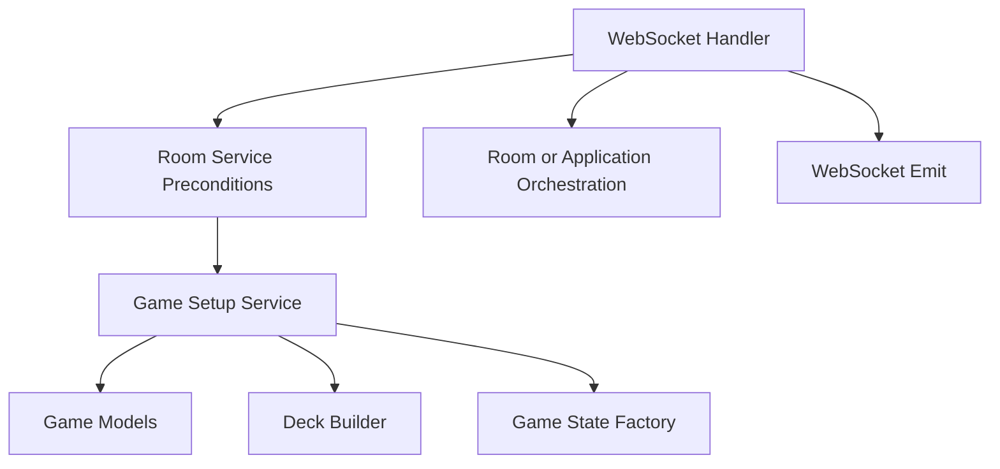

## Goal
Build the deterministic server-side setup flow for a new match.

## Scope
- Build the default deck composition
- Deal initial hands
- Guarantee starting `Defuse` cards
- Insert `Exploding Kitten` cards after dealing
- Initialize turn state for a new game

## Done when
- A new game can be initialized entirely on the server
- Setup follows the current game-engine spec
- Setup output is ready for the turn lifecycle

## Source docs
- `plan/implementation-plan.md`
- `plan/game-engine-spec.md`

## Module design
Plain-text flow:

```text
websocket handler
    -> room service precondition handoff
    -> game setup service
        -> game models
        -> deck builder
        -> game state factory
    -> room/application orchestration
    -> websocket emit
```

Mermaid:



## Game setup boundary
- `game` module owns authoritative server-side match setup after lobby preconditions have passed.
- This issue starts after room/application orchestration has already validated that the room may start.
- Setup state answers:
  - which players are seated in which order
  - which cards are in each player's starting hand
  - which cards remain in the `drawPile`
  - which player takes the first turn
  - which game-phase and turn metadata the match starts with
- Game setup owns deck construction, initial dealing, bomb insertion, and initial turn-state creation.
- Game setup does not validate lobby permissions such as host checks, ready checks, or reconnect ownership.
- Game setup does not emit websocket events directly.
- Game setup does not resolve turn actions in this issue.
- Game setup does not build filtered public payloads in this issue, but its output must support public/private state mapping later.

## Key decisions
- `room` issue 6 stops at `waiting -> starting`; this issue handles `starting -> in_game` by creating initial game state.
- `turnNumber` uses `1-based` indexing and starts at `1` when the match is initialized.
- Seat order is derived from `room.players` in current room order, and `seatIndex` is assigned from that order.
- In MVP, `seat order = join order`.
- The host is `seatIndex = 0` and is the starting player in MVP.
- `currentPlayerId` is the host player with `seatIndex = 0`.
- Each player starts with exactly `1 defuse + 4 additional cards`, for a starting hand size of `5`.
- The setup flow removes one guaranteed `defuse` per player before dealing additional cards.
- Additional starting cards are dealt from the remaining non-bomb deck, which may still contain extra `defuse` cards.
- Every player is guaranteed to receive at least `1 defuse` by appending one reserved `defuse` after the initial `4` dealt cards.
- Starting hand order is deterministic in MVP:
  - deal `4` cards first from the remaining non-bomb deck
  - append the guaranteed `defuse` as the last card in hand
- `Exploding Kitten` cards are never allowed in starting hands.
- `Exploding Kitten` cards are inserted into the `drawPile` only after all starting hands are dealt.
- Default initial turn state is:
  - `roomStatus = in_game`
  - `phase = turn_action`
  - `turnNumber = 1`
  - `pendingDraws = 1`
  - `discardPile = []`
  - `eliminatedPlayerIds = []`
  - `winnerPlayerId = null`
  - `actionLock = false`
- Randomness is controlled only on the server.
- Setup implementation should keep a testable shuffle seam so unit tests can assert deterministic outcomes.
- A simple injected shuffler function is sufficient for this issue; a full RNG abstraction is not required yet.
- `create_initial_game_state(...)` should return authoritative game setup output for both:
  - `ServerGameState`
  - `player_private_states: dict[player_id, PlayerPrivateState]`
- `game` module owns authoritative match state and should use a dedicated game registry rather than storing full game state inside `RoomState`.
- Realtime/application orchestration owns the final handoff after setup:
  - room validation and `waiting -> starting` happen before setup
  - game setup creates initial authoritative game state
  - orchestration persists the resulting room/game state and broadcasts payloads
- This issue does not add manual seat selection.
- This issue does not randomize the starting player.
- This issue does not implement rematch-based starting-player rotation.

## Implementation checklist
### 1. Game models
- `backend/app/modules/game/models.py`
- `CardInstance`
  - `card_id`
  - `card_type`
- `PlayerPrivateState`
- `PlayerPrivateState`
  - `player_id`
  - `hand`
  - `visible_future_cards`
- `GamePlayerSummary`
  - `player_id`
  - `nickname`
  - `status`
  - `hand_count`
  - `seat_index`
  - `is_host`
  - `is_ready`
- This is a server-side summary shape that is safe to include in authoritative game state.
- This is not itself a socket payload contract.
- `ServerGameState`
  - `room_id`
  - `room_status`
  - `phase`
  - `turn_number`
  - `current_player_id`
  - `pending_draws`
  - `players`
  - `draw_pile`
  - `discard_pile`
  - `eliminated_player_ids`
  - `winner_player_id`
  - `action_lock`
  - `created_at`
  - `updated_at`

### 2. Deck builder
- `backend/app/modules/game/setup.py` or `backend/app/modules/game/deck.py`
- Build default deck composition from `playerCount`
- Default composition
  - `exploding_kitten = playerCount - 1`
  - `defuse = playerCount + 2`
  - `skip = 4`
  - `attack = 4`
  - `shuffle = 4`
  - `see_the_future = 5`
  - `favor = 4`
- Create unique `CardInstance` values for every card
- Keep guaranteed starting `defuse` cards separate from the rest of the deck during setup
- Additional starting cards are dealt from the non-bomb deck
- Remaining bombs are inserted only after dealing finishes

### 3. Setup service
- `backend/app/modules/game/service.py`
- Use cases
  - `create_initial_game_state(room)` returns authoritative game setup output:
    - `ServerGameState`
    - `player_private_states: dict[player_id, PlayerPrivateState]`
- Depends on `models.py` and deck/setup helpers
- Setup service only owns match initialization
- Setup service does not validate host/ready/connectivity preconditions
- Setup service does not mutate socket/session state
- Setup service does not emit `game:started` or `game:state` directly
- Setup service should expose a small seam for deterministic testing of shuffle/order-sensitive behavior

### 4. Setup steps
- derive seat order from `room.players`
- build all non-bomb action cards plus total `defuse` count
- reserve `1 defuse` for each player hand
- shuffle the remaining non-bomb deck
- deal `4` additional cards to each player from the shuffled non-bomb deck
- append reserved `defuse` to each player's starting hand
- build the remaining `drawPile`
- insert `playerCount - 1` `exploding_kitten` cards into the `drawPile`
- shuffle the final `drawPile`
- initialize `ServerGameState`
- initialize `PlayerPrivateState` for each player
- mark room/game as ready for first `turn_action`

### 5. Room/application orchestration notes
- `backend/app/realtime/server.py`
- `game:start` should already have passed room preconditions before calling setup
- realtime/application orchestration owns the handoff from `RoomState(status=starting)` to stored game state
- authoritative game state should be stored outside the `room` module in dedicated game state storage
- realtime/application orchestration is responsible for broadcasting public state and private hands after setup
- no direct socket handling from inside the `game` module

### 6. Setup invariants
- supported player count is `3-5`
- every starting player hand has exactly `5` cards
- every starting player hand contains at least `1 defuse`
- no starting player hand contains `exploding_kitten`
- total `exploding_kitten` count in the match is `playerCount - 1`
- total `defuse` count in the match is `playerCount + 2`
- public player snapshot contains `handCount`, not full hand contents
- `discardPile` starts empty
- `eliminatedPlayerIds` starts empty
- `winnerPlayerId` starts as `null`
- `actionLock` starts as `false`
- `pendingDraws` starts as `1`
- `phase` starts as `turn_action`
- `roomStatus` starts as `in_game`

### 7. Hidden information rules at setup
- full hands are private and must not appear in shared room/game payloads
- full `drawPile` order remains server-only
- setup should produce enough structure to later derive:
  - public game state
  - per-player private state
- no player receives another player's hand through setup output mapping

### 8. Tests
- game setup unit tests
- start game with 3 players creates `2` `exploding_kitten`
- start game with 4 players creates `3` `exploding_kitten`
- start game with 5 players creates `4` `exploding_kitten`
- each player starts with exactly `5` cards
- each player starts with at least `1 defuse`
- guaranteed `defuse` is appended after the first `4` dealt cards
- additional dealt cards may include extra `defuse`
- no player starts with `exploding_kitten`
- `drawPile` size matches expected remaining cards after dealing
- `discardPile` starts empty
- `currentPlayerId` is the first seated player
- `pendingDraws` starts at `1`
- `phase` starts at `turn_action`
- `roomStatus` starts at `in_game`
- public game player snapshot uses `handCount` and does not expose hand contents
- deterministic test path can assert known setup output when shuffle behavior is controlled
